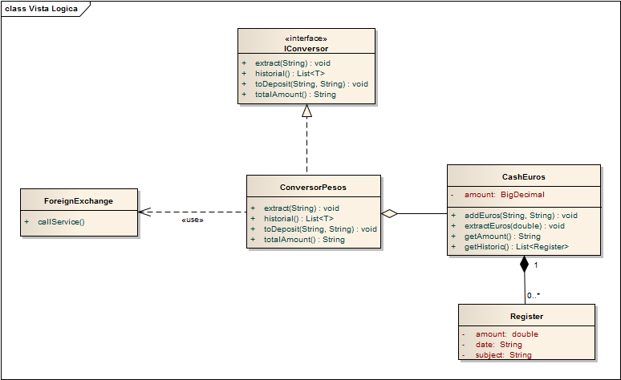

# PatternsAdapter-Example

El patrón Adapter busca una manera estandarizada de adaptar un objeto a otro. Con el fin de poder utilizar las características del objeto original en un contexto diferente.

Este patrón se utiliza generalmente cuándo queremos reutilizar clases ajenas para nuestro sistema, pero, aunque la funcionalidad de estas clases es la que deseamos, la interfaz no es compatible con nuestros requisitos o el contexto de nuestro sistema. Ya sea porque en aspectos legales no podemos modificarla o simplemente no queremos tocar el objeto original.

